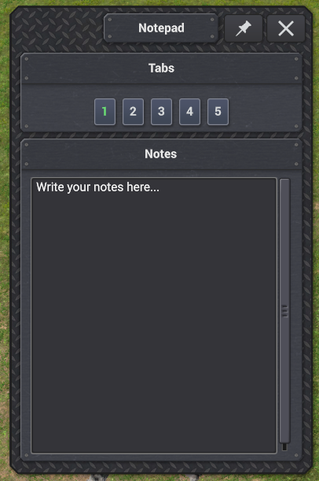

# Notepad mod for Captain of Industry

This is a simple notepad mod that lets you open a floating notepad with tabs in game. It may be useful to write down ideas, todos, calculations or important ratios.

  

# Instalation
- Download the [latest version](https://github.com/trebuHE/notepad-mod/releases/latest) of the mod.
- Extract the mod files into game's Mods folder `%AppData%\Captain of Industry\Mods`.
- Enable the mod in game, can be added and removed from existing saves.

## Dependencies
- (optional) [Keybind Framework](https://coigame.com/Mod/1104/Keybind-Framework) allows for customizing the keybinds.

## Usage
To open/close the notepad window use ``Lctrl + N`` shortcut. Window can be moved and pinned. Notes are saved on focus loss and ``Enter`` press as a ``.txt`` file in game's directory. Tabs are changed using buttons at the top of the window or ``Lctrl + 1-5``.

## Bugs, problems and contributions
In case of problems or bugs feel free to report them in the GitHub Issues or fix them yourself and create a Pull Request. 